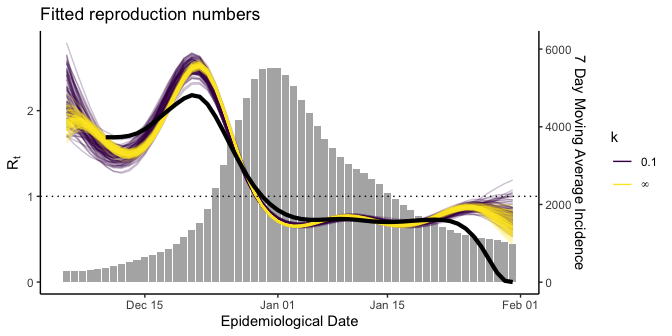

<!-- README.md is generated from README.Rmd. Please edit that file -->

# assessEpidemicCurves

<!-- badges: start -->

[](https://travis-ci.com/jpmeagher/assessEpidemicCurves)
<!-- badges: end -->

The goal of assessEpidemicCurves is to model epidemic curves under
heterogeneous disease reproduction, providing estimates for the
time-varying reproduction number and assessing epidemic curves for
evidence of superspreading. This package accompanies \[Reference our
paper here\]

## Installation

You can install the development version of assessEpidemicCurves from
[GitHub](https://github.com/) with:

``` r
# install.packages("devtools")
devtools::install_github("jpmeagher/assessEpidemicCurves")
```

## Case Study: COVID-19 in the Republic of Ireland

``` r
library(assessEpidemicCurves)
library(rstan)
library(loo)
library(ggplot2)
library(dplyr)
library(magrittr)
library(lubridate)
library(EpiEstim)
library(knitr)
```

We consider the COVID-19 epidemic in the Republic of Ireland from March
1, 2020 to 28 February, 2021.


## The generative model for epidemic curves

Analyses are based on the hierarchical model for the daily incidence
count of COVID-19

 &= \operatorname{Pois} \left( y_t \mid \mu_t + \sum_{s = 1}^t \omega_s \eta_{t-s} \right), \\
p \left( \eta_t \mid k, R_t \right) &= \operatorname{Gamma} \left( \eta_t \mid y_t k, \frac{k}{R_t}\right),
\end{aligned}
")

where
^\top")
is the epidemic curve seeded by
,
^\top")
is the rate at which cases are imported,
^\top")
is the generation interval pmf,
")
is the disease momentum up to day
,
 is the case dispersion
parameter and
^\top")
are the cohort reproduction numbers.

This model is underpinned by a branching process model for secondary
infections such that

 &= \operatorname{Pois} \left( z_{t, i} \mid \nu_{t, i} \right), \\
p \left( \nu_{t, i} \mid k, R_t \right) &= \operatorname{Gamma} \left( k, \frac{k}{R_t}\right),
\end{aligned}
")

where

is the number of secondary infections arising from the

index case on day  with
an individual reproduction number
.
Within this model,
![\\mathbb E \\left\[ z\_{t, i}\\right\] = R\_t](https://latex.codecogs.com/png.latex?%5Cmathbb%20E%20%5Cleft%5B%20z_%7Bt%2C%20i%7D%5Cright%5D%20%3D%20R_t "\mathbb E \left[ z_{t, i}\right] = R_t")
and
 = R_t + R_t^2 / k").
This links to the model for
 via


Thus, the hierarchical model allows for heterogeneous disease
reproduction resulting in over dispersed distributions of secondary
infections, that is, superspreading may be a feature of the epidemic.
Note that
 = 0")
and so this model admits homogeneous disease reproduction as a special
case.

## Prior specification

In order to fit this generative model to data, we fix import rates
^\top"),
the generation interval pmf
^\top"),
and case dispersion parameter
. We then propose a
log-Gaussian process prior for

such that

, \\
f \left( t \right) &\sim \mathcal{GP} \left( 0, k \left(t, t' \right) \right), \\
k \left(t, t' \right) & = \alpha^2 \exp \left( - \frac{\left(t - t'\right)^2}{2 \ell^2}\right),
\end{aligned}
")

where amplitude

and length-scale

are specified a priori.

## Model fitting

The model described here can be computationally expensive to implement
and so we only analyse a subset of the data here. We examine reported
COVID-19 cases from December 10, 2020, to January 31 2020, allowing the
5 days from December 5 to December 9 inclusive to seed the epidemic.

We assume that

for all  and that

is a discretised gamma distribution such that generation intervals have
a mean of 5 days, standard deviation of 2.5, and a maximum of 21 days.
The log-Gaussian process prior for

is specified by

and
.
We fit two models,

where

and

where
.

We adjust the epidemic curve for day of the week effects by taking
 to be the 7-day
moving average of reported cases on day
.

``` r
df <- covid_incidence_roi_epidemiological_date %>% 
  mutate(ma_count = stats::filter(count, rep(1/7, 7)) %>% round) %>% 
  filter(date >= dmy(05122020) & date <= dmy(31012021)) 

D <- nrow(df)
# initialise heterogeneous disease reproduction
init_list <- lapply(
  1:4, function(i) {
    initialise_lgp_Rt(
      epidemic_curve = df$ma_count, 
      gp_amplitude = 1, k = 0.1
)
  } )
# fit heterogeneous disease reproduction
M_0.1 <- fit_Rt_lgp(
  epidemic_curve = df$ma_count, seed_days = 5,
  import_rate = rep(1, D), 
  generation_interval_mean = 5, generation_interval_sd = 2.5,
  generation_interval_length = 21,
  gp_amplitude = 1, gp_length_scale = 10,
  k = 0.1,
  cores = 4, refresh = 500, 
  init = init_list
)
# fit homogeneous disease reproduction
M_inf <- fit_Rt_lgp(
  epidemic_curve = df$ma_count, seed_days = 5,
  import_rate = rep(1, D), 
  generation_interval_mean = 5, generation_interval_sd = 2.5,
  generation_interval_length = 21,
  gp_amplitude = 1, gp_length_scale = 10,
  k = Inf,
  cores = 4, refresh = 500,
  control = list(max_treedepth = 15)
)

wt <- wallinga_teunis(
  incid = df$ma_count, 
  method = "parametric_si",
  config = list(
    t_start = (6:D),
    t_end = 6:D,
    mean_si = 5,
    std_si = 2.5,
    n_sim = 3
  )
)
```

Having fit the models to the epidemic curve we can explore the fitted
posterior for
.
Note that heterogeneous disease reproduction results in greater
uncertainty on estimates for
 on each day. We
include Wallinga & Teunis’ estimate for
,
implemented in the `EpiEstem` package, for comparison. All three
estimates are in broad agreement up until the final days of the assessed
period. The disagreement at this point is consequence of the differing
estimation procedures.

``` r
R_0.1 <- rstan::extract(M_0.1, "R") %>% 
  as.data.frame() %>% 
  magrittr::extract(sample.int(4000, 100), ) %>%
  t() %>% 
  unname() %>% 
  data.frame(date = df$date, R_0.1 = .) %>% 
  reshape2::melt(id = "date")

R_inf <- rstan::extract(M_inf, "R") %>% 
  as.data.frame() %>% 
  magrittr::extract(sample.int(4000, 100), ) %>%
  t() %>% 
  unname() %>% 
  data.frame(date = df$date, R_inf = .) %>% 
  reshape2::melt(id = "date") 


R <- rbind(
  cbind(R_0.1, model = "0.1"),
  cbind(R_inf, model = "inf")
) 

last_day <-dmy(20012021)
y_scalar <- 2.5
R %>%
  dplyr::filter(date <= last_day) %>% 
  ggplot() +
  geom_bar(
    data = df,
    aes(x = date, y = y_scalar * ma_count /  max(df$ma_count) ), stat = "identity",
    alpha = 0.5
  ) +
  geom_line(aes(x = date, y = value, group = variable, color = model), alpha = 0.25) +
  geom_hline(yintercept = 1, lty = 3) +
  scale_color_viridis_d(labels = c("0.1", bquote(infinity))) +
  scale_y_continuous(
    bquote("R"["t"]),
    sec.axis = sec_axis(~ . * max(df$ma_count) / y_scalar, name = "7 Day Moving Average Incidence")
  ) +
  theme_classic() +
  guides(colour = guide_legend(override.aes = list(alpha = 1))) +
  geom_line(
    data = data.frame(
      date = df$date[6:D], R = wt$R$`Mean(R)`
    ) %>% 
      dplyr::filter(date <= last_day),
    aes(x = date, y = R), lwd = 1
  ) +
  labs(
    title = "Fitted reproduction numbers",
    x = "Epidemiological Date",
    color = "k"
  )
#> Warning: Use of `df$ma_count` is discouraged. Use `ma_count` instead.
```



## Model comparison

PSIS-LOO provides an easy to implement measure of model fit. All
Pareto- diagnostic
values are less than 0.7, indicating that both models fit the data well
and estimates for the expected log point-wise predictive density (elpd)
for a new dataset are reliable.

``` r
loo_0.1 <- loo(M_0.1, moment_match = TRUE)
#> Warning: Some Pareto k diagnostic values are slightly high. See help('pareto-k-diagnostic') for details.
loo_inf <- loo(M_inf, moment_match = TRUE)
#> Warning: Some Pareto k diagnostic values are slightly high. See help('pareto-k-diagnostic') for details.

loo_compare(loo_0.1, loo_inf) %>% 
  kable(digits = 2, caption = "PSIS-LOO model selection favours $\\mathcal M_{0.1}$ (model1) over $\\mathcal M_{\\infty}$ (model2).")
```

|        | elpd\_diff | se\_diff | elpd\_loo | se\_elpd\_loo | p\_loo | se\_p\_loo |  looic | se\_looic |
|:-------|-----------:|---------:|----------:|--------------:|-------:|-----------:|-------:|----------:|
| model1 |       0.00 |     0.00 |   -265.86 |          3.60 |   6.22 |       1.11 | 531.72 |      7.20 |
| model2 |     -16.31 |     5.95 |   -282.17 |          8.52 |   8.36 |       1.90 | 564.34 |     17.04 |

PSIS-LOO model selection favours

(model1) over

(model2).

This model comparison supports

over
,
indicating that superspreading is a feature of the COVID-19 epidemic in
the Republic of Ireland. This suggests that estimates for

offered by

provide a more appropriate quantification of uncertainty and should be
preferred to those of
.
