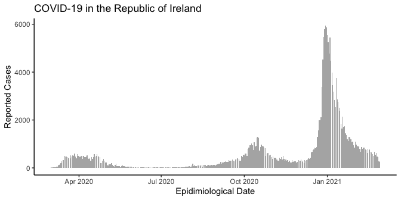

<!-- README.md is generated from README.Rmd. Please edit that file -->

# assessEpidemicCurves

<!-- badges: start -->

[](https://travis-ci.com/jpmeagher/assessEpidemicCurves)
<!-- badges: end -->

The goal of assessEpidemicCurves is to model epidemic curves under
heterogeneous disease reproduction, providing estimates for the
time-varying reproduction number and assessing epidemic curves for
evidence of superspreading. This package accompanies \[Reference\]

## Installation

You can install the development version of assessEpidemicCurves from
[GitHub](https://github.com/) with:

``` r
# install.packages("devtools")
devtools::install_github("jpmeagher/assessEpidemicCurves")
```

## Case Study: COVID-19 in the Republic of Ireland

``` r
library(assessEpidemicCurves)
library(ggplot2)
```

We consider the COVID-19 epidemic in the Republic of Ireland from March
1, 2020 to 28 February, 2021.


