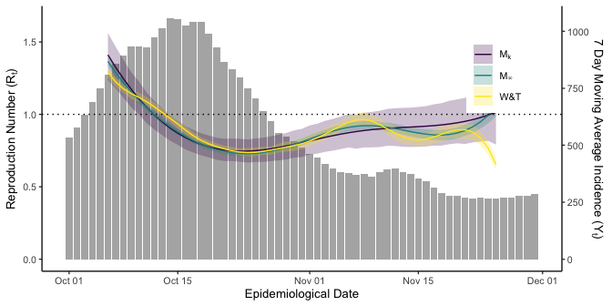
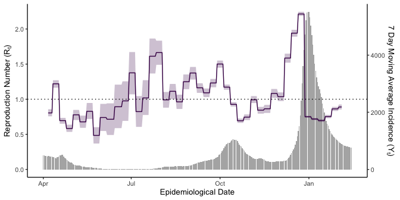

<!-- README.md is generated from README.Rmd. Please edit that file -->

# assessEpidemicCurves

<!-- badges: start -->

[](https://travis-ci.com/jpmeagher/assessEpidemicCurves)
<!-- badges: end -->

The goal of assessEpidemicCurves is to model epidemic curves under
heterogeneous disease reproduction, providing estimates for the
time-varying reproduction number and assessing epidemic curves for
evidence of superspreading. This package accompanies \[Reference our
paper here\]

## Installation

You can install the development version of assessEpidemicCurves from
[GitHub](https://github.com/) with:

``` r
# install.packages("devtools")
devtools::install_github("jpmeagher/assessEpidemicCurves")
```

## Case Study: COVID-19 in the Republic of Ireland

``` r
library(assessEpidemicCurves)
library(rstan)
library(loo)
library(ggplot2)
library(dplyr)
library(magrittr)
library(lubridate)
library(EpiEstim)
library(knitr)
library(reshape2)
library(HDInterval)
library(latex2exp)
library(matrixStats)
```

As a case study we include the epidemic curve of confirmed COVID-19
cases in the Republic of Ireland from March 1, 2020 to 28 February,
2021. Cases are ordered by epidemiological date. This is either the date
of onset of symptoms, date of diagnosis, laboratory specimen collection
date, laboratory received date, laboratory reported date or the
notification date.


## The generative model for epidemic curves

Analyses are based on a hierarchical model for the daily incidence count
of COVID-19

, \\
\eta_t \mid k, R_t &\sim \operatorname{Gamma} \left( y_t k, \frac{k}{R_t}\right),
\end{aligned}
")

where
^\top")
is the epidemic curve seeded by
,
^\top")
is the rate at which cases are imported,
^\top")
is the generation interval pmf,
")
is the disease momentum up to day
,
 is the case dispersion
parameter and
^\top")
are the cohort reproduction numbers.

This model is underpinned by a branching process model for secondary
infections such that

, \\
\nu_{t, i} \mid k, R_t &\sim \operatorname{Gamma} \left( k, \frac{k}{R_t}\right),
\end{aligned}
")

where

is the number of secondary infections arising from the

index case on day  with
an individual reproduction number
.
Within this model,
![\\mathbb E \\left\[ z\_{t, i}\\right\] = R\_t](https://latex.codecogs.com/png.latex?%5Cmathbb%20E%20%5Cleft%5B%20z_%7Bt%2C%20i%7D%5Cright%5D%20%3D%20R_t "\mathbb E \left[ z_{t, i}\right] = R_t")
and
 = R_t + R_t^2 / k").
This links to the model for
 via


Thus, the hierarchical model allows for heterogeneous disease
reproduction resulting in over dispersed distributions of secondary
infections, that is, superspreading may be a feature of the epidemic.
Note that
 = 0")
and so this model admits homogeneous disease reproduction as a special
case.

## Prior specification

In order to fit this generative model to data, we fix import rates
^\top"),
the generation interval pmf
^\top"),
and case dispersion parameter
. We then propose a
Gaussian process prior for

such that

, \\
f \left( t \right) &\sim \mathcal{GP} \left( 0, k \left(t, t' \right) \right), \\
k \left(t, t' \right) & = \alpha^2 \exp \left( - \frac{\left(t - t'\right)^2}{2 \ell^2}\right),
\end{aligned}
")

where amplitude

and length-scale

are specified a priori.

## Model fitting

The model described here can be computationally expensive to implement
and so we restrict our analysis to a subset of the data. We examine
reported COVID-19 cases from December 10, 2020, to January 31 2020,
allowing the 5 days from December 5 to December 9 inclusive to seed the
epidemic.

We assume that

for all  and that

is proportional to a discretised gamma distribution such that generation
intervals have a mean of 5 days, standard deviation of 2.5, and a
maximum of 21 days. The Gaussian process prior for

is specified by

and
.
We fit two models,

where

and

where
.

We smooth over day-of-the-week effects in the epidemic curve by taking
 to be the 7-day
moving average of reported cases on day
.

``` r
first_day <- dmy(05122020)
last_day <- dmy(31012021)
df <- covid_incidence_roi_epidemiological_date %>% 
  mutate(ma_count = stats::filter(count, rep(1/7, 7)) %>% round) %>% 
  filter(date >= first_day & date <= last_day) 
D <- nrow(df)
# initialise heterogeneous disease reproduction
init_list <- lapply(
  1:4, function(i) {
    initialise_lgp_Rt(
      epidemic_curve = df$ma_count, 
      gp_amplitude = 1, k = 0.1
      )
    }
  )
# fit heterogeneous disease reproduction
M_0.1 <- fit_Rt_lgp(
  epidemic_curve = df$ma_count, seed_days = 5,
  import_rate = rep(1, D), 
  generation_interval_mean = 5, generation_interval_sd = 2.5,
  generation_interval_length = 21,
  gp_amplitude = 1, gp_length_scale = 10,
  k = 0.1,
  cores = 4, refresh = 500, 
  init = init_list
)
# fit homogeneous disease reproduction
M_inf <- fit_Rt_lgp(
  epidemic_curve = df$ma_count, seed_days = 5,
  import_rate = rep(1, D), 
  generation_interval_mean = 5, generation_interval_sd = 2.5,
  generation_interval_length = 21,
  gp_amplitude = 1, gp_length_scale = 10,
  k = Inf,
  cores = 4, refresh = 500,
  control = list(max_treedepth = 15)
)

wt <- wallinga_teunis(
  incid = df$ma_count, 
  method = "parametric_si",
  config = list(
    t_start = (5:(D-2)),
    t_end = 7:D,
    mean_si = 5,
    std_si = 2.5,
    n_sim = 100
  )
)
```

Having fit these models to the epidemic curve we can explore the fitted
posterior for
.
Note that heterogeneous disease reproduction results in greater
uncertainty on estimates for
 on each day. We
include Wallinga & Teunis’ estimate for
,
implemented in the `EpiEstem` package, for comparison. All three
estimates are in broad agreement. Estimates for
 on the final ten
days of the period are omitted as these index cases remain infectious
and so their reproduction number depends on secondary infections that
may or may not occur in the future.

``` r
R_0.1 <- rstan::extract(M_0.1, "R") %>% 
  as.data.frame() %>% 
  colMeans()
ci_0.1 <- rstan::extract(M_0.1, "R") %>% 
  as.data.frame() %>% 
  hdi()

R_inf <- rstan::extract(M_inf, "R") %>% 
  as.data.frame() %>% 
  colMeans() 
ci_inf <- rstan::extract(M_inf, "R") %>% 
  as.data.frame() %>% 
  hdi()

y_scalar <- ci_0.1[, -(1:5)] %>% 
  max()

data.frame(
  date = df$date,
  a = R_0.1,
  b = R_inf,
  wt = c(rep(NA, 5), wt$R$`Mean(R)`, rep(NA, 1))
  ) %>%
  filter(date <= last_day -10) %>% 
  filter(date >= first_day + 5) %>% 
  reshape2::melt(id.vars = "date") %>%
  ggplot() +
  theme_classic(base_size = 10) +
  theme(legend.position = c(0.875, 0.75)) +
  geom_bar(
    data = df,
    aes(x = date, y =  y_scalar * ma_count / max(ma_count)), stat = "identity",
    alpha = 0.5
  ) +
  geom_ribbon(
    data = data.frame(
      date = df$date[6:(D-1)], 
      hdi = cbind(
        lower = wt$R$`Quantile.0.025(R)`, 
        upper = wt$R$`Quantile.0.975(R)`), 
      model =  "wt"
      ) %>% 
      rbind(data.frame(date = df$date, hdi = t(ci_0.1), model =  "a")) %>% 
      rbind(data.frame(date = df$date, hdi = t(ci_inf), model =  "b")) %>% 
      filter(date <= last_day - 10) %>% 
      filter(date >= first_day + 5),
    aes(x = date, ymin = hdi.lower, ymax = hdi.upper, fill = model),
    alpha= 0.25
  ) +
  geom_line(aes(x = date, y = value, color = variable)) +
  scale_color_viridis_d(labels = c(bquote("M"[0.1]), bquote("M"[infinity]), "W&T")) +
  scale_fill_viridis_d(labels = c(bquote("M"[0.1]), bquote("M"[infinity]), "W&T")) +
  geom_hline(yintercept = 1, lty = 3) +
  scale_y_continuous(
    TeX("Reproduction Number $(R_t)$"),
    sec.axis = sec_axis(
      ~ . * max(df$ma_count) / y_scalar, 
      name = TeX("7 Day Moving Average Incidence $(Y_t)$")
      )
  ) +
  labs(
    x = "Epidemiological Date",
    color = NULL,
    fill = NULL
  ) 
```



## Model comparison

We adopt a Leave-Future-Out (LFO) Cross-Validation (CV) approach to
model comparison, estimating the posterior predictive density for

under


 = \int p \left( y_{t+1} \mid \boldsymbol \theta_{0:t}, \boldsymbol y_{0:t}, \mathcal M_k \right) p \left( \boldsymbol \theta_{0:t} \mid \boldsymbol y_{0:t}, \mathcal M_k \right) d \boldsymbol \theta_{0:t},
")

where
")
and

is the set of model parameters and latent variables up to time
. This amounts to
one-step-ahead prediction (1-SAP) for the epidemic curve.

Given
}")
drawn from
")
for

we have that

 \approx \sum_{m = 1}^M p \left( y_{t+1} \mid \boldsymbol \theta_{0:t}^{\left( m \right)}, \boldsymbol y_{0:t}, \mathcal M_k \right)
")

If 
observations are required for reliable 1-SAP, then we assess the
performance of

using its LFO expected log predictive density (ELPD)

.
")

We refit

for each estimate of
")
assuming that

 \approx p \left( y_{t+1} \mid \boldsymbol y_{(t - L):t}, \mathcal M_k \right),
")

such that we only fit to

observations up to time 
to obtain the estimate (this becomes

observations when
 days seed the
epidemic).

For illustrative purposes, we present LFO-CV for the 15 days from 10-24
December, 2020 with

and
.
This comparison requires a few minutes to complete.

``` r
n_samples <- 4000
N0 <- 5
L <- 21 # lead in days to prediction
first_validation_day <- dmy(10122020)
last_validation_day <- dmy(25122020)
M <- as.numeric(last_validation_day - first_validation_day)
# Get 7-day moving average
df <- covid_incidence_roi_epidemiological_date %>%
  mutate(ma_count = stats::filter(count, rep(1/7, 7)) %>% round)
# candidate models
candidate_k <- c(0.1, Inf)

posterior_predictive <- log_lik <- list()
for (j in seq_along(candidate_k)) {
  i <- 1
  day <- first_validation_day
  tmp_posterior_predictive <- tmp_log_lik <- array(dim = c(n_samples, M))
  # pb <- txtProgressBar(min = 0, max = M, style = 3)
  while (day < last_validation_day) {
    df_i <- df %>%
      filter(date >= day - (L + N0) & date < day)
    fit_i <- fit_Rt_lgp(
      epidemic_curve = df_i$ma_count, seed_days = 5,
      import_rate = rep(1, (L + N0)),
      generation_interval_mean = 5,
      generation_interval_sd = 2.5,
      generation_interval_length = 21,
      gp_amplitude = 1, gp_length_scale = 10,
      k = candidate_k[j],
      ahead = TRUE,
      next_day_cases = df$ma_count[df$date == day],
      next_day_import_rate = 1, refresh = 0
    )
    tmp_posterior_predictive[, i] <- unlist(rstan::extract(fit_i, "y_rep_ahead"))
    tmp_log_lik[, i] <- unlist(rstan::extract(fit_i, "log_lik_ahead"))
    day <- day + 1
    # setTxtProgressBar(pb, i)
    i <- i + 1
  }
  posterior_predictive[[j]] <- tmp_posterior_predictive
  log_lik[[j]] <- tmp_log_lik
  # close(pb)
}
```

``` r
pointwise_elpd <- sapply(
  log_lik, 
  function(x) colLogSumExps(x) - log(n_samples)
  )
elpd_lfo <- apply(pointwise_elpd, 2, sum)
se_elpd_lfo <- apply(
  pointwise_elpd, 2, 
  function(x) sqrt(length(x) * var(x))
  )

best_fit <- which.max(elpd_lfo)
diff_elpd <- sweep(pointwise_elpd, 1, pointwise_elpd[, best_fit]) %>% 
  apply(2, sum)
se_diff_elpd <- sweep(pointwise_elpd, 1, pointwise_elpd[, best_fit]) %>% 
  apply(2, function(x) sqrt(length(x) * var(x)))
```

|        |   elpd | se\_elpd | elpd\_diff | se\_elpd\_diff |
|:-------|-------:|---------:|-----------:|---------------:|
| model1 | -80.40 |     3.06 |        0.0 |           0.00 |
| model2 | -82.19 |     3.54 |       -1.8 |           2.29 |

LFO model comparison of

(model1) and

(model2).

Model comparison for the validation period provides some support for

over
,
indicating that heterogeneity is a feature of the COVID-19 epidemic in
the Republic of Ireland. This suggests that estimates for

by

provide more appropriate uncertainty quantification and should be
preferred to those of
.

## Alternative model comparison

Pareteo-smoothed importance sampling (PSIS) for approximate
leave-one-out cross-validation (LOO-CV) provides an easy to implement
measure of model fit. Although time series data are not exchangeable and
violate the assumptions underpinning LOO-CV, PSIS LOO-CV offers an
efficient approach to model comparison. Applying this technique to

and

fit to COVID-19 cases from December 10, 2020, to January 31 2020, we
find that all Pareto-
diagnostic values are less than 0.7, indicating that both models fit the
data well.

``` r
loo_0.1 <- loo(M_0.1, moment_match = TRUE)
#> Warning: Some Pareto k diagnostic values are slightly high. See help('pareto-k-diagnostic') for details.
loo_inf <- loo(M_inf, moment_match = TRUE)
#> Warning: Some Pareto k diagnostic values are slightly high. See help('pareto-k-diagnostic') for details.
```

|        | elpd\_diff | se\_diff | elpd\_loo | se\_elpd\_loo | p\_loo | se\_p\_loo |  looic | se\_looic |
|:-------|-----------:|---------:|----------:|--------------:|-------:|-----------:|-------:|----------:|
| model1 |       0.00 |      0.0 |   -265.93 |          3.61 |   6.27 |       1.14 | 531.86 |      7.21 |
| model2 |     -16.07 |      5.8 |   -282.00 |          8.42 |   8.69 |       2.04 | 564.01 |     16.85 |

PSIS-LOO model comparison favours

(model1) over

(model2).

As before, this model comparison supports

over
,
although it will over-estimate the 1-SAP accuracy.

## Alternative priors

The package also includes a simpler prior for

which fits data more efficiently. The histogram estimator for

is defined by

,
\end{aligned}
")

for the set of disjoint intervals

discretising time. The interval
 defines the

bin for the estimator where

![
I\_j = \\left( N - j \\delta, N - (j - 1) \\delta \\right\],
](https://latex.codecogs.com/png.latex?%0AI_j%20%3D%20%5Cleft%28%20N%20-%20j%20%5Cdelta%2C%20N%20-%20%28j%20-%201%29%20%5Cdelta%20%5Cright%5D%2C%0A "
I_j = \left( N - j \delta, N - (j - 1) \delta \right],
")

covers a bin width of
 days,
then the histogram estimator for

is defined by


Assuming that

and
,
this model fits the epidemic curve from April 01, 2020 to February 14,
2021 in seconds.

``` r
first_day <- dmy(01042020)
last_day <- dmy(14022021)
df <- covid_incidence_roi_epidemiological_date %>% 
  mutate(ma_count = stats::filter(count, rep(1/7, 7)) %>% round) %>% 
  filter(date >= first_day & date <= last_day) 
D <- nrow(df)
# fit homogeneous disease reproduction
H_inf <- fit_Rt_hist(
  epidemic_curve = df$ma_count, seed_days = 5,
  import_rate = rep(1, D), 
  generation_interval_mean = 5, generation_interval_sd = 2.5,
  generation_interval_length = 21,
  bin_width = 7,
  k = Inf,
  cores = 4, refresh = 500
)
```



The LFO framework for model comparison can also be applied to this model
to objectively tune the bin width
. The
model also accommodates heterogeneous disease reproduction given some
fixed value for .
